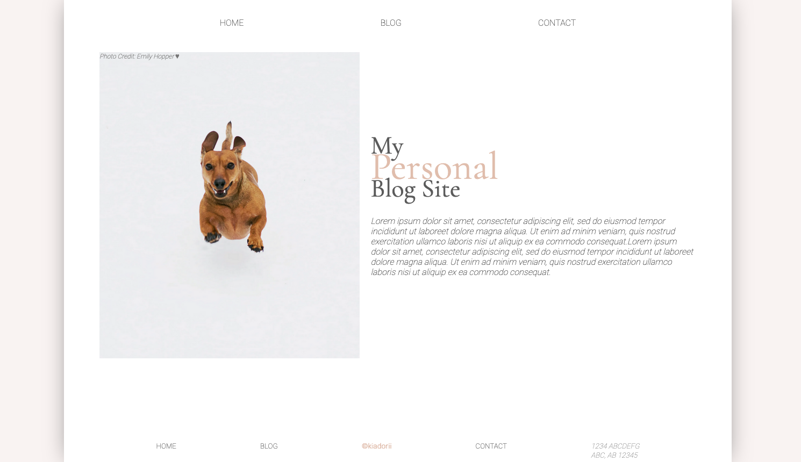

# Blog Website

**About**:

_The purpose of this project was to solidify the foundations of my HTML and CSS skills. Focus was on CSS Grid, CSS Flex, Web Accessibility, and Responsive Web Design (Media Queries)._

Below are the inspirations I used this project to model after along with images with their corresponding photographers.

**Inspiration:**

- Main Page: https://dribbble.com/shots/3830535-Minimal-Website-Concept-Free-Sketch-7

- Footer: https://www.canva.com/learn/footer-design/

**Images:**

- Main Pic: https://www.pexels.com/@emilyhopper

- Blog Pic #1: https://www.pexels.com/@valeriya

- Blog Pic #2: https://www.pexels.com/@disguise-truth/

- Blog Pic #3: https://www.pexels.com/@wildlittlethingsphoto

**Social Media Icons**:

- All icons: https://www.flaticon.com/packs/social-media-91
